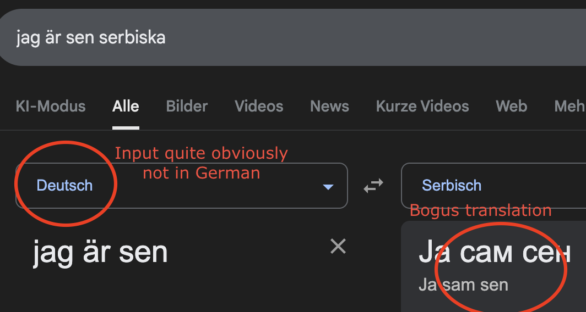

#  Translation TUI

A command-line translation tool built with Go, bubbletea, and Google's Gemini API. Get full sentence translations plus detailed word-by-word grammatical analysis.

## Problem 😤



- A quick google search usually requires me to manually type out both source and target languages for every query

- Googling translations often mix languages or incorrectly identify the input/output language

- Lack of grammatical context

## Features

- Choose a language you know and one you want to learn
- Interactive sentence input - no need to specify which is the input language
- Full sentence translation
- Word-by-word translation with grammatical details


## Prerequisites

- Go 1.25 or later
- A Google Gemini API key

## Installation

1. Clone or download this repository

2. Install dependencies:
```bash
go mod download
```

3. Set your Gemini API key:
```bash
export GEMINI_API_KEY=your_api_key_here
```
## Usage

Run the application:
```bash
go run .
```

Or build and run:
```bash
go build -o myapp
go run .
```

## Supported Languages

Possibly any, but I restricted them to the ones that currently where interesting to me.

## Example

1. Select source language (e.g., English)
2. Select target language (e.g., Spanish)
3. Enter sentence, either in English or Spanish
4. View translation and word-by-word analysis with grammatical information in regards to the foreign language

## Implementation Notes
- TUI built with [bubbletea](https://github.com/charmbracelet/bubbletea), following the [Elm Architecture](https://guide.elm-lang.org/architecture/)
- Uses Google's Gemini API with structured JSON output
- Built in Go for native SDK integration

## Technical Notes
As with any AI-powered translation system, results may vary with ambiguous or complex input, particularly when dealing with context-dependent phrases or idiomatic expressions. Direct word-to-word translations can be hard to realize for languages with strongly differing sentence structures.

## Learnings

- Model struggled with instruction following of a relatively simple task → Split into separate API calls for translation and analysis, each with their own structured output.

- Over-structured output schemas can confuse and prevent logical, coherent output → Simplified to word + analysis fields, let model handle details.

- Terminal UI is limiting → Works as proof of concept, GUI would be better.

## Future Improvements

- Explore using tool calls and handover mechanisms to create a more interactive, conversational experience
- Implement a chat-like interface that remembers previous translations and allows users to ask follow-up questions about grammar
- Build a personal vocabulary database that tracks translated words and phrases, enabling spaced repetition and progress tracking
- Develop a web or desktop application with interactive visualizations


